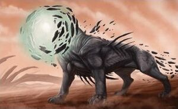
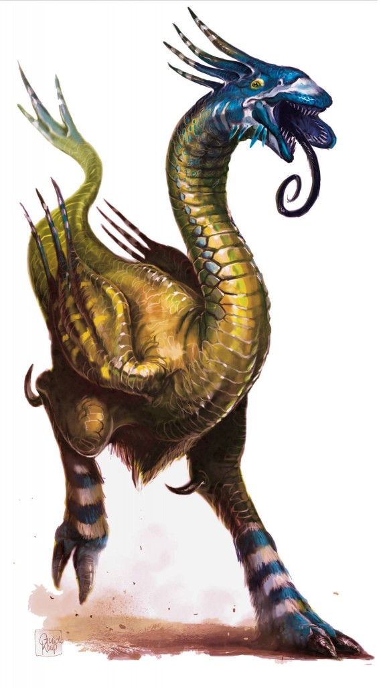

# New Monsters

### Sarrak

Original Info(e):
* A fearsome predator in the Ninth World.
* Body of a massive predatory cat, about 8-foot (2.4m) long, with sleek muscles and black flesh
* Its head appears to bea  3-foot-wide ball of swirling energy, surrounded by dozens of metallic plates that move as if in orbit around the energy
* biomechanical in nature, taps into the minds of other cratures or controls of electrical devices
* extroadoniarily intelligent
* Claw attack
* Control PCs and electrical devices
* heal very quickly, regenerate X per round
* GM Intrusion - takes over a device

### Ithsyn

* Loud and horrible
* Result of generic experiment gone awry
* Distinctive qualities of avians, reptiles, mammals, and fish. Difficult to categorize
* Egg layers and live in large communal nests, firecly defend them
* carnivores hunt in packs, looking for prey of any size
* don't hear particularly well
* rely on their long, snakelike tongues for much of their sensing
* hungers for flesh
* charges forward in a burst of speed
* can move up to a long distance and attack with a savage kick, or weird trifurcated mouth
* If struck in combat, releases a dark greenish gas from orifices throughout its body.
* Failed save, addled for a round
 

