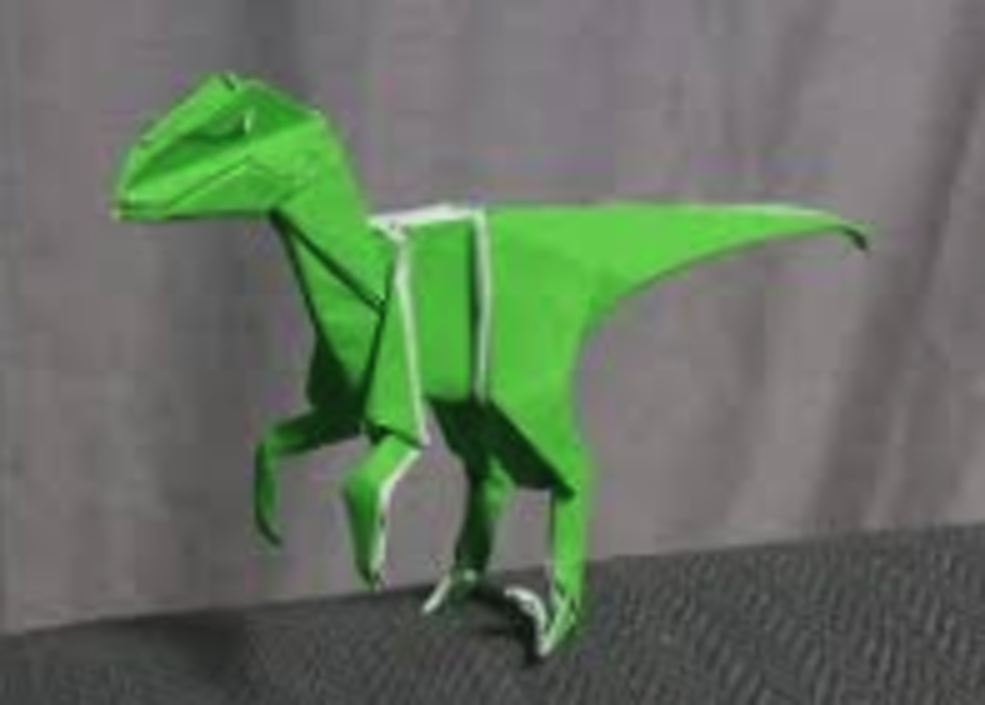

# Session Notes

Reverse chronology

# Session 2 - Fun in Town

Inside of the Borer in the Castle-Lantern graveyard, 
Jessica and Bargain are at the dashboard figuring
things out.  From the inside, you can see out of a window over
the boring blade.  On the "driver's side" of the forward control
panel, the primary controls are a lever in a horizontal track with
five positions, currently in the middle.  and another lever in a vertical
track with three positions. Currently in the middle.  The machine
gently thrums.

With Jessica moving the vertical lever up, the thrum becomes
rapid.  Moving the lever back to the middle returns the thrum
to its original tempo.  Moving the lever down cuts power and
turns on a dim red light inside.  Bargain figures out how to
turn on and off the inner lights.

The inside of the borer is empty space, with two dozen subway handles
hanging from the ceiling. The wall opposite the door has panels and 
buttons similar to the map-device on the front dashboard.  Towards
the back is a large glowing stone, brightening and dimming in rhythm
to the machine's thrumming.

Mui is experimenting with the door.  A pushbutton
(glowing) drops the door open (anyone outside, LOOK OUT! as the door
slams down), and pushing again draws it up.  There's also a lever
in a vertical track next to the door (three positions, middle position)
with what feels like a mechanical linkage around the door, acting like
an emergency door opener.

Sam went out to chat with Yanhsa (captain of the guard) about
(I forget why, outside of a search for alcohol for Jessica), when
she invites the crew to dinner and a night at the town Inn in
appreciation. "oh, and there's something weird going on at the library
if you have some time"

Sam returned (no alcohol), to fill everyone in, and started examining
the glowing stone - it's in a glass cylinder (about two
feet in diameter), held in place with a coupling collar. When Jessica 
turns off the power to the device, the stone goes dark and Sam removes
it.  It's like a red gem(?) Jessica couldn't turn the machine back 
on again.  Sam restores the gem.  Everything returns to normal.

After more poking around the device, found the keyfob in the dashboard
and figured out how to lock and unlock the device.

### The Paper Chase

A young, blonde Elf wearing gray robes, came running into the area. He
was shouting "Arma's hurt!  Yansha!  Yansha!  You have to come help!"
Yansha took off running, with the party hot oh her heels.  Running through
town, it's a much larger place than Nextia, probably the same population
as Orlane, but much more densely packed (and without glowing numerals
rotating above each of the buildings).  

The Elf (Darrel Southwell, the library assistant) and Yansha stop in front
of the library.  "I was downstairs trying to repair the damage.  Arma
heard something upstairs.  I heard a shout and a scream, and then silence.
Go get Yansha. That was my first thought"

Entering, you see a scene of bookish destruction. Tall 
bookshelves, with most of their contents on the floor.  Investigating the
shelves, Jessica discovers neat piles of pages at the end of each row of
bookshelves.  They're complete stories.  Laeryn reads a book of Elven 
stories, or at least tries to.  Numerous spans of pages are torn(?) out.
The book of stories has nothing in it but the commentaries between the
stories.

There's a sound from upstairs.  Some kind of shuffling.  Bargain stealths
away and heads upstairs, with Mui not far behind.  Up the stairs is a similar
scene of horror - books off one of the shelves, a nice stack of removed pages
at the end of the bookshelf. And going through the books is a... dinosaur?
made of ... paper?

It's methodically grabbing a book from the shelf.  Flipping through the
pages, and with a paper claw, slicing out some pages, and adding it to
the stack.  Mui sees Arma (Wynn), a red-skin Tiefling, in a gray
robe. She's slumped on the floor. Maybe some blood there.

The rest of the party joins the monks, narrowly avoiding the squeaking stair
tread.  Jessica runs past the monster to grab Arma behind some bookshelves,
determines she's alive, and tries to stabilize her. Sam assists.  

Mui and Bargain engage with the Thesaurus. Blows are exchanged
(bludgeoning seems to not really... do much), the tide of battle not
really turning until Jessica cuts it with her sword, un-handing it.  
Mui absorbs the bulk of damage the monster dealt from its bite(?) 
and claws(?), sustaining wicked paper cuts.  Laeryn lands the killing blow,
and the Thesaurus crumples into a green and white paper boulder.  Mui
recovers a sizable quantity of paper _(I forgot the actual dimensions, 
hope you did :-) )_

Sam heals up most of the party, leaving Jessica alone per request.
Sam also get Arma up and talking.  "We're just a small town library
with a really great collection, left to us when a wealthy land owner
died 50 years ago.  Scholars from around the area come by for research.
Figboot's friend Punita was here a couple of days ag. We had a wonderful
time talking about everything, and I took off yesterday and gave
Darrell some time off because we were exhausted. Puntia ran us ragged.
When I got here this morning, there was this scene of destruction, and
you kind of know the rest."

Darrell lopes up the stairs and takes over taking care of Arma, as the
party leaves the Library. Yansha led the party across the town square,
to Gwatney's cafe for food and drink. Upon entering the beautiful 
eatery, the party is greeted by a red-haired dwarf (graying) coming
out of the kitch, chef's outfit (kind of like what Klär wore on occasion
on her vision-stone program) and apron, pristinely clean.  "Welcome
to Gwatney's!"

----

# Session 1 - A Boring Day

Bargain (halfling monk) and Quon (gold dragonborn monk) coming into
Nextia, a small bump in the road along the road who's main economies
are farming, livestock, and adventurers. Nextia has Azizah's smithy,
Grindlebrew's house of potions, Punita's _Publisher's Bookshop_, and
_Figboot's Inn and Tavern_.

Coming in to town, they met Sam talking (?) with Lord
Peter Chompsey.  From our point of view, it sounds like a lot of
screaming.  A sturdy bugbear was mucking out Chompy's pen, complaining
about dinosaur poop.  Quon ducked in to Figboot's, leaving Bargain to
watch.

Bargain felt a buzzing on his finger.  Anyone who works with Figboot
is given a ring - if you want to earn some gold doing a job for Figboot,
put on the ring. When there's work, it'll ~page~ mystically vibrate
for the wearer.  Take it off when you're not available.

Heading in to Figboot's, he sees Azizah Ironhammer bolting out of the
door, screaming "They've Kidnapped Xander!  You have to come help me", and
a party of four or five adventurers running after here. The one in
bright shiny armor shouting "Take comfort!  We will save him!".  

Going to
the door, Bargain sees Boz'Lee - Figboot's goblin assistant, leaning against
the building smoking a cigarette.  Boz'Lee says "yah, another audition.  I
gotta keep a low profile til they're out."  Glances at his bare wrist.  "Still
got a couple of hours before I gotta go help. Figgy's got a new job. Come'on"

The tavern is a typical tavern, six or so tables.  The local farmers sometimes
grab lunch or meals here.  On the wall is a framed object - an offset longsword
with a signed note "Mel, you make the best R.W.A.F. in the land.  <3 Klär"

Boz'Lee heads to the kitchen to get some snacks. Sam buys Bargain
a R.W.A.F.™.  Then the crew assembles in Figboot's office, a familiar place
when getting assignments.  While waiting for Figboot, Quon comes out, looking
kind of disturbed, and tells Bargain that he's got to go take care of something
and he's on his own.

The assignment is something weird happening in Castle-Lantern.  Not sure what.
Standard pay. The pay schedule

* General task - 100gp each
* Task with risk to life and limb - 250gp each
* Risky task. Don't ask questions. Just do it. - 500gp each

10gp advance before leaving.  Credit line at the Stables (horse mount 2gp/day)

Ratcatchers are welcome to any treasure or magic items found during
the assignment.

Jessica spends her advance on three flasks of alcohol, and tips Floon
well.  They have an understanding.

### On the Road

The party heads north to Castle-Lantern on horseback.  On the road,
Sam hears "Make way! On your left!  Make way!".  Sam yields the left
side of the road, as a man (casually dressed) on an ostrich zooms by.
"Thank you I appreciate it...." as he dopplers path.

### In Castle-Lantern

Entering the small town of Castle-Lantern (about the same size
as Orlane, which some of the party is quite familiar with), the party
hears q commotion coming from across town. Heading that way lead by Jessica, they're intercepted
by Yansha, the Captain of the town guard. She looks to be a career guardshuman.

"We don't know what's really going on.  A giant... thing erupted out of the
cemetery on the edge of town, vomiting forth undead who started attacking
the town. We've managed to fight them back and keep them from getting
back into town, but we can't stop them.  They seem army. They know what
they're doing.  Beware of the door.  Our innkeeper went to check it out
when it appeared, and got crushed by the door when it opened.

Heading to the cemetery, the party sees a large, house-sized metal contraption
with a dimly glowing purple crystal in the back.  The device is cylindrical,
with three tank treads equidistant around its circumference. It's not moving,
and vaguely thrumming.  A squad of undead - skeletons in tattered uniforms,
with a tough looking squad leader barking out orders in an unfamiliar
tongue, and the troops doing calisthenics.

An attempt at parlay was met by battle.  Bargain and Mui deploying
brilliant team tactics.  Sam and Jessica trading taunts and
congratulations.  One squad defeated, as another squad marched around
the back side of the contraption.  The door opens.  Bargain (I think)
was almost crushed by the door, but hopped up on a tread.  The general
popped out, inspiring the troops, but she too was eventually defeated.
Upon her death, the remaining half-squad of undead soldiers perished.

All was quiet. Except an occasional thrum... thrum...

Jessica leading the way into the borer, sits down at the console and fiddles
around for a while, she managed to make it lurch forward a bit using foot
pedals.  Tweedling knobs on the console made a screen light up.  Mostly
it was glowing text, replaced by more glowing text, in an alphabet(?) that
nobody recognizes.

After some time, they found what looks like a map of the continent,
but not quite as folks remember.  _(Presuming Bargain's wide travels
gives him a knowledge of regional geography)_ An extra peninsula where
a large island should be. A couple of missing large bodies of water.  Turing
one of the knobs. A dot appears in a far corner.  Turning the knob, it grows
into a straight line. Then the straight line angles. Then angles again. Then
it stops moving. A couple of turns later, the line starts moving
again, but in an erratic fashion, like a housefly buzzing around.  This
goes on for quite the distance, until it stops.  Which happens to be around
where you are on the great map of the area.

# Area Map

