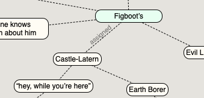
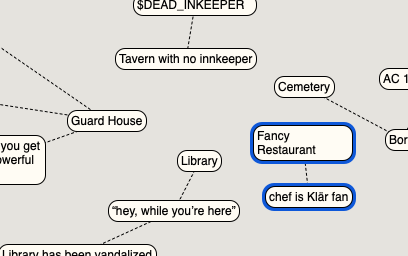

# Ideas for Support Software

## Scoutliner

Scapple + Outliner

would be cool to have say these scapple bubbles:

and then open up "Castle-Lantern" to get an embedded document:

Essentially an outliner, but with the really breezy UI of Scapple.

Plus text-based document storage, for storing in source code control.

SwiftUI - no collection view equivalent.  CocoaHeads dude has done
an SVG editor thing with a combination of a canvas and swiftui jazz:
https://github.com/bengottlieb/SwiftVG/tree/master/Sources/SwiftVG/Views
